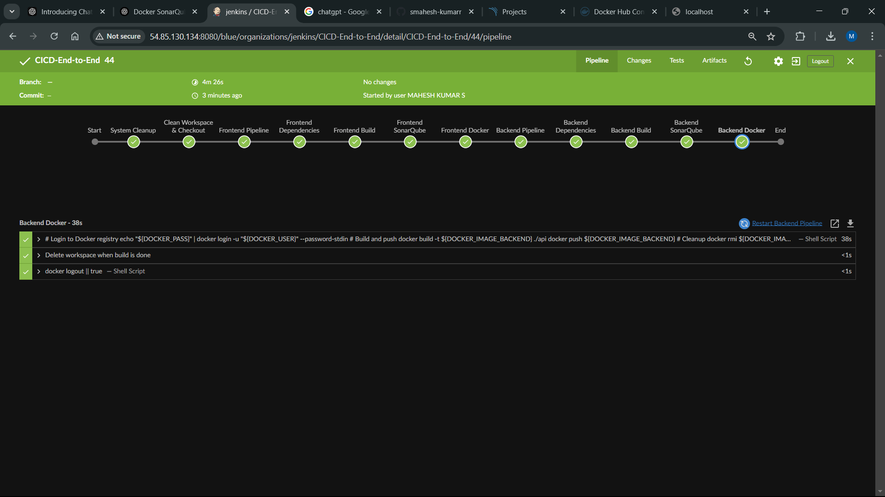

# 🚀 BlogApp MERN Stack Project | CI/CD Pipeline 🛠️  
**Version 2.0 (ArgoCD Deployment Coming Soon!)**  
 
 
 
-%23FF9900?logo=amazon-aws)

---

## 🌟 Project Overview  
A full-stack MERN (MongoDB, Express, React, Node.js) blog application with a **fully automated CI pipeline** powered by Jenkins.  
🚧 **CD (ArgoCD) in progress for Version 2.0!**  

---

## 🔄 CI/CD Pipeline Architecture  
  
*(Replace with your architecture diagram)*  

### 🛠️ Pipeline Highlights  
- **Jenkins Server**: Running on AWS EC2 (t2.medium) 🖥️  
- **Source Code**: Hosted on GitHub 📦  
- **Docker Agents**: Jenkins workers in Docker containers 🐳  
- **SonarQube**: Code quality checks with `sonar-scanner` 🔍  
- **Docker Hub**: Automated image builds & pushes 🚢  

---

## 🧩 Technologies Used  
| Category       | Tools & Services                                                                 |
|----------------|----------------------------------------------------------------------------------|
| **CI/CD**      | Jenkins, Docker, SonarQube, Maven, Shell Scripting                               |
| **Cloud**      | AWS EC2, Docker Hub                                                              |
| **Frontend**   | React.js, HTML/CSS, npm                                                          |
| **Backend**    | Node.js, Express, MongoDB                                                        |
| **Monitoring** | SonarQube (Code Quality), Jenkins Pipeline Reports                               |

---

## 🚀 Getting Started  

### ⚙️ Prerequisites  
- Jenkins server (with Git, Maven, Docker plugins)  
- SonarQube instance (`http://54.85.130.134:9000`)  
- Docker Hub credentials stored in Jenkins Secrets 🔑  

### 🔧 Pipeline Stages  
---

## 🔄 CI/CD Pipeline Stages  

1. 🧹 **System Cleanup**  
   - Docker system prune  
   - npm cache clean  
   - Remove old `node_modules`  

2. 📥 **Checkout Code**  
   - Git clone from GitHub repository  

3. 🖥️ **Frontend Pipeline**  
   - Install dependencies (`npm install`)  
   - Build React app (`npm run build`)  
   - SonarQube code analysis  
   - Docker build & push  

4. ⚙️ **Backend Pipeline**  
   - Install dependencies (`npm install`)  
   - Build Node.js app  
   - SonarQube code analysis  
   - Docker build & push  

5. 🧼 **Post-Build Cleanup**  
   - Workspace cleanup  
   - Docker logout  

---

## 🛠️ Jenkins Pipeline Snippet  

```groovy
pipeline {
    agent any
    environment {
        SONAR_URL = "http://54.85.130.134:9000"
        DOCKER_IMAGE_FRONTEND = "maheshkumars772/frontend:latest"
        DOCKER_IMAGE_BACKEND = "maheshkumars772/backend:latest"
    }
    stages {
        stage('Frontend Build') {
            steps {
                sh 'npm install --legacy-peer-deps'
                sh 'DISABLE_ESLINT_PLUGIN=true npm run build'
            }
        }
        stage('Docker Push') {
            steps {
                sh 'echo "$DOCKER_PASS" | docker login -u "$DOCKER_USER" --password-stdin'
                sh 'docker build -t $DOCKER_IMAGE_FRONTEND ./client'
            }
        }
    }
}
```
---

## 🔮 Future Enhancements (Version 2.0)  

- **ArgoCD Integration** for GitOps-style deployments 🌐  
- Kubernetes cluster setup for staging/production 🚢  
- Automated testing with Selenium/Cypress 🧪  
- Slack notifications for build status 📢  

---

## 👨💻 Contributors  

**Mahesh Kumar**  
[](https://github.com/smahesh-kumarr)  
[](https://hub.docker.com/u/maheshkumars772)  

---

> **Note**: This README will auto-update when ArgoCD is integrated! Stay tuned for v2.0! 🎉   🎉
